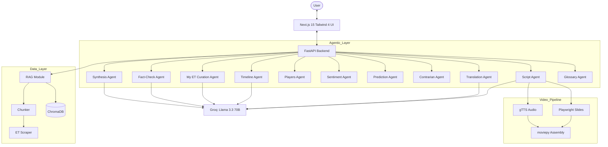

# ET Pulse — Project Status & Architecture

**ET Pulse** is an AI-native financial newsroom for the **Economic Times**, designed to deliver real-time, personalized, and highly structured market briefings.

---

## ✅ Completed Accomplishments

### 1. Data Pipeline & Management
- **Article Scraper**: Implemented a robust scraper using `newspaper3k` to ingest Economic Times news articles.
- **Content Chunker**: Intelligent chunking system (400 chars, 80 overlap) for precise RAG retrieval.
- **Vector Base (ChromaDB)**: Local vector storage using `all-MiniLM-L6-v2` embeddings (no external API needed for indexing).
- **RAG Retrieval**: Optimized similarity search scoring (Cosine Similarity via ChromaDB) returning top-N relevant snippets.

### 2. AI Agent Ecosystem
- **LLM Migration**: Successfully migrated from Google Gemini to **Groq (`llama-3.3-70b-versatile`)** for ultra-low latency generation.
- **Synthesis Agent**: Generates structured briefings with mandatory sections: *Background, Key Development, Market Impact, Key Players, and What to Watch*.
- **Persona System**: Tailored briefings for different users: *General Reader, MF Investor, Tech Founder, and Student*.
- **Fact-Check Agent**: Real-time evaluation of AI-generated content against source documents with confidence scoring.
- **Curation Agent (My ET)**: Personalized news feed generation based on user profiles and interests.
- **Glossary Agent**: 120+ finance term detector with definitions — detects terms like SIP, SEBI, IPO in briefings.
- **Translation Agent**: Cultural adaptation for Hindi and Marathi with regional newspaper-style writing.

### 3. Story Arc Tracker (Day 3)
- **Timeline Builder**: D3.js interactive horizontal timeline with clickable event nodes.
- **Key Players**: Entity extraction and card grid display.
- **Sentiment Analysis**: Chart.js time-series sentiment visualization.
- **Predictions**: 3 forward-looking AI signals with rationale.
- **Contrarian View**: Underrepresented perspectives surfaced by AI.
- **Audit Log**: SQLite-backed decision transparency for all agent calls.

### 4. AI Video Studio (Day 4)
- **Script Agent**: Claude-powered 5-part broadcast script generation.
- **TTS Pipeline**: gTTS audio narration in English, Hindi, Marathi.
- **Slide Generation**: Playwright-based visual slide rendering (1920×1080).
- **Video Assembly**: moviepy concatenation into MP4 at 24fps.
- **Video Studio UI**: Full page with language selector, progress indicator, video player, and script accordion.

### 5. Vernacular Engine (Day 4, Updated Day 5)
- **Languages**: English, Hindi, Marathi (updated from 5 to 3 focused languages).
- **Cultural Adaptation**: Loksatta-style for Marathi, Dainik Bhaskar-style for Hindi.
- **Finance Glossary**: 45-term glossary with culturally adapted definitions.
- **Audio Briefings**: gTTS-powered listen mode for translated content.

### 6. Cross-Feature Integration (Day 5)
- **Interconnected Features**: All 5 features are linked — generate video from a briefing, track stories across arc and feed.
- **Extended Home Page**: Premium landing with hero, feature cards, stats, how-it-works, and CTA sections.
- **Glossary Tooltips**: 120 finance terms auto-detected in briefings with hover definitions.
- **Related Stories**: ChromaDB similarity search shows 3 related articles after each briefing.
- **Live Indicator**: Pulsing green "Live" badge on My ET feed header.
- **Skeleton Loading**: Reusable shimmer skeleton components for all pages.
- **Video Pre-fill**: Navigating from briefing to Video Studio pre-fills article text.
- **Track Story**: Save stories from Story Arc to localStorage for feed tracking.

### 7. Backend Infrastructure (FastAPI)
- **SSE Streaming**: Full support for Server-Sent Events (SSE) providing real-time text generation in the UI.
- **API Modularization**: 13 route modules: brief, stream, followup, feed, arc, audit, video, translate, auth, bookmarks, history, glossary, related.
- **Static Asset Serving**: Infrastructure for video/audio content delivery.

### 8. Frontend Experience (Next.js & Tailwind)
- **Modern UI**: Clean, premium Dashboard using **Tailwind CSS 4** and **Next.js 15 (App Router)**.
- **Dark Mode**: Full dark/light theme support with glassmorphism effects.
- **Micro-Animations**: Framer Motion animations on homepage, card hover effects, streaming indicators.
- **Mobile Responsive**: Responsive navigation drawer, adaptive layouts.

---

## 🏗️ System Architecture

### High-Level Design
The system follows a **RAG-based AI architecture** with a specialized Agentic layer for synthesis, personalization, and cross-feature intelligence.

### Technology Stack
- **Frontend**: React 19, Next.js 15, TypeScript, Tailwind CSS 4, Framer Motion.
- **Backend**: FastAPI, Pydantic, Uvicorn.
- **Orchestration**: Custom Python Agents with `groq-sdk`.
- **Vector Engine**: ChromaDB (Persistent).
- **Embeddings**: `sentence-transformers` (Local).
- **LLM Provider**: Groq (Llama 3.3 70B Versatile).
- **Video**: gTTS + Playwright + moviepy.
- **Languages**: English, Hindi, Marathi.

---

## 🚀 Next Steps (Day 6-7)
- Full UI audit — spacing, typography, dark mode consistency.
- Pre-generate demo videos and arc cache for demo mode.
- Architecture document and impact model.
- Pitch video recording.
- Final QA, regression testing, and submission.
