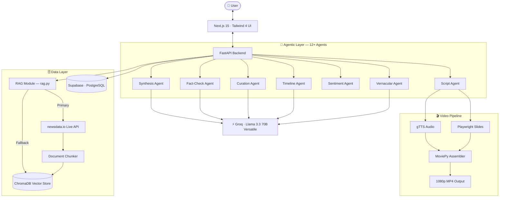
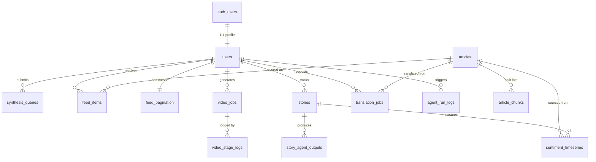

<div align="center">


# ET Pulse ⚡

### The AI-Native Financial Newsroom of the Future

*Built for the Economic Times Hackathon 2026*

<br/>

[](https://economictimes.indiatimes.com/)
[](https://groq.com)
[](https://nextjs.org/)
[](https://fastapi.tiangolo.com/)
[](https://www.trychroma.com/)
[](https://newsdata.io/)
[](https://supabase.com/)


<br/>

> **ET Pulse** transforms traditional linear financial journalism into dynamic, personalized, multi-agent intelligence experiences. Stop reading 15 articles to understand one event — get structured briefings, automated video segments, sentiment timelines, and culturally-adapted vernacular summaries, all in seconds.

<br/>

[Explore Features](#-the-5-core-experiences) · [Architecture](#️-system-architecture) · [Database](#️-database-architecture) · [Quick Start](#️-getting-started) · [Tech Stack](#-tech-stack) · [Changelog](#-changelog) · [Contributing](#-contributing)

</div>

---

## 📸 Overview

ET Pulse is a comprehensive financial intelligence platform built on a **multi-agent AI orchestration layer**. It reimagines how users consume complex financial news by delivering:

- **Live news ingestion** via the `newsdata.io` API with a seamless offline ChromaDB fallback
- **RAG-powered synthesis** across financial article archives with zero hallucinations
- **Persona-aware feed curation** for students, investors, and professionals
- **Narrative intelligence** that tracks complex financial stories end-to-end
- **AI video generation** that converts briefings into broadcast-ready segments in under 30 seconds
- **Vernacular adaptation** that goes beyond translation into true cultural localization

---

## 🚀 The 5 Core Experiences

### 1. 🔍 News Navigator — RAG Synthesis Engine

Stop reading 15 articles to understand one event. Enter any query and the **Synthesis Agent** retrieves exact, cited snippets from across financial archives to generate a structured, comprehensive briefing — streamed live.

| Capability | Detail |
|---|---|
| **Live Data** | Real-time article ingestion via `newsdata.io` API (India-region, English) |
| **Offline Fallback** | Automatic failover to local ChromaDB if the API rate-limits or fails |
| **Embeddings** | Local `all-MiniLM-L6-v2` via `sentence-transformers` |
| **Vector Store** | ChromaDB (persistent, local) |
| **Streaming** | Real-time token delivery via Server-Sent Events (SSE) |
| **Citation** | 100% grounded claims — every statement is source-linked |
| **Glossary** | Inline financial term tooltips for complex jargon |

---

### 2. 📰 My ET Feed — Persona-Driven Curation

No two users are alike. The **Curation Agent** dynamically scores and ranks incoming news stories based on your professional background, portfolio composition, and declared interests.

- **Roles Supported**: Undergraduate Student · Mutual Fund Investor · Tech Founder · Trader · Analyst
- **Justification Blocks**: Every article surfaces a reason — *"This SEBI regulation directly affects your algo-trading portfolio."*
- **Real-Time Rescoring**: Your feed re-ranks itself as new stories break
- **Pagination**: "Load More Insights" support with cursor-offset logic for infinite scrolling through AI-curated news
- **Regional Focus**: Hard-constrained to English-language, India-region (`country=in`) sources for maximum relevance

---

### 3. 📈 Story Arc Tracker — Narrative Intelligence

Financial news doesn't happen in a vacuum. Track complex multi-week sagas — IPO rollouts, hostile takeovers, RBI policy cycles — through a **5-agent parallel intelligence dashboard**.

| Agent | Function |
|---|---|
| **Timeline Agent** | Chronologically plots all major events in a story |
| **Key Players Agent** | Extracts entities, roles, and relationships |
| **Sentiment Agent** | Time-series charting of evolving market mood |
| **Predictions Agent** | Forward-looking AI impact signals |
| **Contrarian Agent** | Surfaces underrepresented and dissenting perspectives |

All five agents run in parallel, updating the dashboard simultaneously.

---

### 4. 🎬 AI Video Studio — Broadcast-Ready in 30 Seconds

Convert any financial brief into a polished, narrated news segment automatically.

```
Groq Script Agent  →  gTTS Audio  →  Playwright Slide Generation  →  MoviePy Assembly  →  1080p MP4
```

- **Output**: Fully assembled 1080p MP4 with synced narration, visual context cards, and ET branding
- **Use Case**: Ready for YouTube Shorts, Instagram Reels, or in-app video briefings
- **Latency**: End-to-end generation in under 30 seconds

---

### 5. 🌐 Vernacular Newsroom — Cultural Adaptation Engine

Financial literacy should have no language barrier. Unlike basic machine translation, the **Vernacular Agent** culturally adapts content — rewriting briefings in the style of *Loksatta* (Marathi) or *Dainik Bhaskar* (Hindi).

**Supported Languages:**

`English` · `Hindi` · `Marathi`

- **Style Adaptation**: Writing tone matched to regional publication standards
- **Regional Glossaries**: Dedicated financial term vocabularies per language
- **Audio Narration**: Full text-to-speech output in the target language

---

## 🏗️ System Architecture

ET Pulse is powered by a multi-agent orchestration layer connecting a Next.js UI to ultra-low-latency Groq inference.



---

## 🗄️ Database Architecture

ET Pulse uses **Supabase (PostgreSQL)** as its primary relational store, with ChromaDB handling vector embeddings. The two layers are bridged via shared `article_id` / `chunk_id` UUIDs carried as ChromaDB metadata, so every vector search result can be joined back to the full relational context in a single query.

### Migration Files

| # | File | Contents |
|---|------|---------|
| 1 | `database/001_schema.sql` | 7 enum types, 15 tables, all foreign keys, indexes, triggers |
| 2 | `database/002_rls_policies.sql` | RLS enabled on all tables + 25 explicit policies |
| 3 | `database/003_storage.sql` | 3 storage buckets + owner-scoped access policies |

### Entity Relationship Diagram



### Relationships

**1:1**

| Parent | Child | Join Key | Notes |
|--------|-------|----------|-------|
| `auth.users` | `public.users` | `user_id` UUID | Every Supabase Auth user gets exactly one profile row |
| `public.users` | `public.feed_pagination` | `user_id` UUID PK | One pagination cursor per user |

**1:Many**

| Parent | Child | FK Column | Notes |
|--------|-------|-----------|-------|
| `users` | `synthesis_queries` | `user_id` | Each user can make many RAG queries |
| `users` | `feed_items` | `user_id` | Each user has many curated feed items |
| `users` | `stories` | `user_id` | Each user can track many stories |
| `users` | `video_jobs` | `user_id` | Each user can generate many videos |
| `users` | `translation_jobs` | `user_id` | Each user can request many translations |
| `users` | `agent_run_logs` | `user_id` | Each user triggers many agent runs |
| `articles` | `article_chunks` | `article_id` | One article is split into many chunks |
| `articles` | `feed_items` | `article_id` | One article can appear in many users' feeds |
| `articles` | `sentiment_timeseries` | `source_article_id` | One article generates many sentiment readings |
| `articles` | `translation_jobs` | `source_article_id` | One article can be translated many times |
| `stories` | `story_agent_outputs` | `story_id` | Each story has outputs from 5 agents per run |
| `stories` | `sentiment_timeseries` | `story_id` | Each story accumulates many sentiment data points |
| `video_jobs` | `video_stage_logs` | `job_id` | Each job has up to 4 stage logs |

**Many:Many Bridge**

| Table | Bridges | Unique Constraint |
|-------|---------|-------------------|
| `feed_items` | `users` ↔ `articles` | `(user_id, article_id)` — one relevance score per user per article |

---

### Enum Types (7 total)

| Enum | Values | Used By |
|------|--------|---------|
| `user_role` | `student`, `mf_investor`, `tech_founder`, `trader`, `analyst` | `users.role` |
| `story_status` | `active`, `archived` | `stories.status` |
| `arc_agent_type` | `timeline`, `key_players`, `sentiment`, `predictions`, `contrarian` | `story_agent_outputs.agent_type` |
| `sentiment_label` | `positive`, `neutral`, `negative` | `sentiment_timeseries.sentiment_label` |
| `video_job_status` | `queued`, `processing`, `complete`, `failed` | `video_jobs.status` |
| `video_stage` | `script`, `tts`, `slides`, `assembly` | `video_stage_logs.stage` |
| `target_language` | `hindi`, `marathi`, `english` | `translation_jobs`, `language_glossary` |

---

### Index Strategy

| Pattern | Index Type | Tables |
|---------|-----------|--------|
| `user_id` lookups | B-tree | All user-scoped tables |
| `created_at DESC` | B-tree | All tables with temporal queries |
| `(user_id, relevance_score DESC)` | Composite B-tree | `feed_items` — sorted feed queries |
| `(story_id, measured_at DESC)` | Composite B-tree | `sentiment_timeseries` — time-series charts |
| Text search on titles | GIN trigram | `articles`, `language_glossary` |
| URL deduplication | Unique B-tree | `articles.url` |

---

### Row Level Security

| Table | SELECT | INSERT | UPDATE | DELETE | Strategy |
|-------|--------|--------|--------|--------|----------|
| `users` | Own | Own | Own | Own | `auth.uid() = user_id` |
| `articles` | Auth'd | — | — | — | Public read, service write |
| `article_chunks` | Auth'd | — | — | — | Public read, service write |
| `synthesis_queries` | Own | Own | — | — | Immutable audit log |
| `feed_items` | Own | Own | Own | Own | Full user CRUD |
| `feed_pagination` | Own | Own | Own | — | Cursor upsert |
| `stories` | Own | Own | Own | Own | Full user CRUD |
| `story_agent_outputs` | Own* | — | — | — | *Via JOIN to `stories.user_id` |
| `sentiment_timeseries` | Own* | — | — | — | *Via JOIN to `stories.user_id` |
| `video_jobs` | Own | Own | — | — | User creates, service updates |
| `video_stage_logs` | Own* | — | — | — | *Via JOIN to `video_jobs.user_id` |
| `translation_jobs` | Own | Own | — | — | Immutable job records |
| `language_glossary` | Auth'd | — | — | — | Read-only reference data |
| `agent_run_logs` | Own | — | — | — | Read own, service writes |
| `api_usage_logs` | — | — | — | — | Service-only (no user policies) |

---

### Storage Buckets

| Bucket | Public | Size Limit | MIME Types | Path Pattern |
|--------|--------|-----------|------------|--------------|
| `video-outputs` | No | 100 MB | MP4, WebM | `{user_id}/*.mp4` |
| `audio-outputs` | No | 20 MB | MP3, WAV, OGG | `{user_id}/*.mp3` |
| `article-media` | Yes | 10 MB | JPEG, PNG, WebP, GIF, SVG | Public read, service write |

> Upload files with the path pattern `{user_id}/{filename}` to leverage the folder-based RLS policies automatically.

---

### ChromaDB ↔ Supabase Join Strategy

ChromaDB handles vector similarity search; Supabase handles all relational semantics. Every chunk ingested into ChromaDB carries Supabase UUIDs as metadata, enabling vector results to be joined back to user state, feed scores, and sentiment data in a single Supabase query.

**Required metadata on every ChromaDB document:**

```python
chroma_collection.add(
    ids=[chunk_chroma_id],
    documents=[chunk_text],
    metadatas=[{
        # Supabase join keys
        "article_id":   str(article_uuid),   # → articles.article_id
        "chunk_id":     str(chunk_uuid),     # → article_chunks.chunk_id
        "chunk_index":  chunk_index,         # → article_chunks.chunk_index
        # Denormalised fields for filter-without-join
        "title":    article_title,
        "url":      article_url,
        "date":     published_at_iso,
        "topic":    category_string,
        "source":   source_name,
        "language": "en",
        "country":  "in",
    }],
    embeddings=[embedding_vector],
)
```

**Join flow — vector search result → full relational context:**

```
User Query
    │
    ▼
ChromaDB.query(query_embedding, n_results=5)
    │  returns: chunk texts + metadata (article_id, chunk_id)
    ▼
Supabase: SELECT * FROM articles WHERE article_id = ANY($1)
    │
    ▼
Full article metadata + user feed state + sentiment data
```

**Joinable paths from a single `metadata.article_id`:**

| Target | Query |
|--------|-------|
| Full article metadata | `articles WHERE article_id = ?` |
| All chunks of that article | `article_chunks WHERE article_id = ?` |
| User's feed relevance score | `feed_items WHERE article_id = ? AND user_id = ?` |
| Sentiment readings | `sentiment_timeseries WHERE source_article_id = ?` |
| Translations | `translation_jobs WHERE source_article_id = ?` |

---

### Python Integration (supabase-py)

The `backend/db/supabase_client.py` module exposes 10 async helper functions for use across FastAPI route handlers:

```python
from backend.db import (
    insert_feed_item,          # Score and store an article for a user
    get_story_agent_outputs,   # Fetch all 5 agents' outputs for a story
    log_agent_run,             # Observability — log any agent run
    upsert_article,            # Ingest an article from newsdata.io
    save_story_agent_output,   # Persist one agent's output JSON
    bulk_insert_feed_items,    # Batch-score multiple articles
    create_video_job,          # Initialise a video pipeline job
    update_video_job_status,   # Update job status and output URLs
    log_api_usage,             # Track newsdata.io call metadata
)
```

**Insert a scored feed item:**
```python
await insert_feed_item(
    user_id="d4e5f6a7-...",
    article_id="a1b2c3d4-...",
    relevance_score=0.87,
    justification="This SEBI regulation directly affects your algo-trading portfolio.",
)
```

**Fetch all Story Arc agent outputs:**
```python
outputs = await get_story_agent_outputs(story_id="abc123...")
timeline  = outputs.get("timeline",  {}).get("output_json", {})
sentiment = outputs.get("sentiment", {}).get("output_json", {})
```

**Log an agent run for observability:**
```python
await log_agent_run(
    agent_type="synthesis",
    module="news_navigator",
    prompt_tokens=1200,
    completion_tokens=850,
    latency_ms=1340,
    user_id="d4e5f6a7-...",
)
```

---

### Migration Order

Run the following in your Supabase SQL Editor **in sequence**:

```
1. database/001_schema.sql        — Enums, tables, indexes, triggers
2. database/002_rls_policies.sql  — Enable RLS + all 25 policies
3. database/003_storage.sql       — Buckets + storage access policies
```

> **Important:** The schema references `auth.users`. Ensure Supabase Auth is enabled on your project *before* running any migration — the `users` table carries a hard foreign key to `auth.users(id)`.

---

## 🧰 Tech Stack

### Backend
| Layer | Technology |
|---|---|
| **Framework** | FastAPI + Uvicorn |
| **LLM Engine** | Groq API — `llama-3.3-70b-versatile` |
| **Orchestration** | LangChain |
| **Vector Database** | ChromaDB (persistent) |
| **Embeddings** | `sentence-transformers` — `all-MiniLM-L6-v2` |
| **Live News** | `newsdata.io` API (India-region, English) |
| **Relational Database** | Supabase (PostgreSQL) — 15 tables, 7 enums, 25 RLS policies |
| **Video Generation** | `moviepy` + `playwright` + `gTTS` |
| **Data Validation** | Pydantic v2 |
| **Containerization** | Docker + Docker Compose |

### Frontend
| Layer | Technology |
|---|---|
| **Framework** | Next.js 15 (App Router) |
| **Language** | TypeScript |
| **Styling** | Tailwind CSS 4 + semantic CSS variables |
| **Animations** | Framer Motion |
| **Icons** | Lucide React |
| **Typography** | Merriweather (Editorial) + Inter (Data/UI) |

### Design System
- **Theme**: High-contrast dark mode with semantic CSS variable tokens replacing all hardcoded classes; Slate/Zinc base with ET Red + Gold brand accents
- **Effects**: Glassmorphism via `backdrop-filter`, noise textures, micro-interaction animations
- **Philosophy**: Premium Fintech SaaS — professional Lucide SVG iconography, financial-grade Merriweather + Inter typographic stack

---

## 📂 Project Structure

```
ET-Pulse/
├── backend/
│   ├── app/
│   │   ├── api/            # REST & SSE endpoint definitions
│   │   ├── agents/         # Individual AI agent modules (12+)
│   │   │   ├── synthesis.py
│   │   │   ├── curation.py
│   │   │   ├── timeline.py
│   │   │   ├── sentiment.py
│   │   │   ├── vernacular.py
│   │   │   └── script.py
│   │   ├── core/           # App config, settings, dependencies
│   │   ├── models/         # Pydantic schemas & data models
│   │   ├── services/       # RAG pipeline, video assembly, scraper
│   │   │   ├── rag/
│   │   │   │   ├── rag.py          # Live API fetch + ChromaDB fallback
│   │   │   │   ├── chunker.py
│   │   │   │   ├── embedder.py
│   │   │   │   └── retriever.py
│   │   │   ├── video/
│   │   │   │   ├── tts.py
│   │   │   │   ├── slides.py
│   │   │   │   └── assembler.py
│   │   │   └── scraper.py
│   │   └── main.py         # FastAPI app entry point
│   ├── db/
│   │   └── supabase_client.py  # 10 async Supabase helper functions
│   ├── requirements.txt
│   ├── .env.example
│   └── docker-compose.yml
│
├── database/
│   ├── 001_schema.sql          # 7 enums, 15 tables, indexes, triggers
│   ├── 002_rls_policies.sql    # RLS + 25 explicit policies
│   └── 003_storage.sql         # 3 storage buckets + access policies
│
└── frontend/
    ├── app/
    │   ├── api/            # API client layer
    │   ├── feed/           # My ET Feed page (with pagination)
    │   ├── navigator/      # News Navigator (RAG) page
    │   ├── story/          # Story Arc Tracker page
    │   ├── video/          # AI Video Studio page
    │   ├── vernacular/     # Vernacular Newsroom page
    │   ├── privacy/        # Privacy Policy page
    │   ├── terms/          # Terms of Service page
    │   └── page.tsx        # Home / landing page
    ├── components/         # Reusable UI components (22+ dark-mode patched)
    │   ├── ui/
    │   ├── agents/
    │   └── layout/
    ├── lib/                # Utilities, hooks, constants
    ├── public/
    └── .env.example
```

---

## ⚙️ Getting Started

### Prerequisites

- Node.js v18+
- Python 3.10+
- Docker & Docker Compose (optional, for containerized deployment)
- A [Groq API Key](https://console.groq.com/)
- A [newsdata.io API Key](https://newsdata.io/)
- A [Supabase project](https://supabase.com/) with Auth enabled

---

### 1. Clone the Repository

```bash
git clone https://github.com/your-org/et-pulse.git
cd et-pulse
```

### 2. Run Database Migrations

In your Supabase project's SQL Editor, run in order:

```
database/001_schema.sql
database/002_rls_policies.sql
database/003_storage.sql
```

### 3. Configure Environment Variables

**Backend** — create `backend/.env` from the example:
```bash
cp backend/.env.example backend/.env
```

```env
# Required — Groq LLM inference
GROQ_API_KEY=your_groq_api_key_here

# Required — Live news ingestion
NEWSDATA_API_KEY=your_newsdata_api_key_here

# Required — Supabase database
SUPABASE_URL=your_supabase_project_url
SUPABASE_KEY=your_supabase_anon_key

# Optional — Frontend URL for Playwright slide generation
NEXT_PUBLIC_API_URL=http://localhost:3000
```

**Frontend** — create `frontend/.env.local` from the example:
```bash
cp frontend/.env.example frontend/.env.local
```

```env
NEXT_PUBLIC_BACKEND_URL=http://localhost:8000
```

---

### 4a. One-Click Start (Windows — PowerShell)

```powershell
# From the project root — installs all dependencies and starts both servers
.\run_app.ps1
```

This script will:
1. Create a Python virtual environment and install `requirements.txt`
2. Run `npm install` for the frontend
3. Install Playwright's Chromium browser
4. Launch FastAPI on `localhost:8000` and Next.js on `localhost:3000` concurrently

---

### 4b. Manual Start (Linux / macOS)

**Start the Backend:**
```bash
cd backend
python -m venv venv
source venv/bin/activate
pip install -r requirements.txt
playwright install chromium
uvicorn main:app --reload --port 8000
```

**Start the Frontend** (in a separate terminal):
```bash
cd frontend
npm install
npm run dev
```

---

### 4c. Docker Compose

```bash
# From the project root
docker-compose up --build
```

This starts the FastAPI backend, ChromaDB, and Supabase edge proxy in a networked container cluster.

---

### Accessing the Application

| Service | URL |
|---|---|
| **Frontend (Next.js)** | http://localhost:3000 |
| **Backend API (FastAPI)** | http://localhost:8000 |
| **API Docs (Swagger)** | http://localhost:8000/docs |
| **API Docs (ReDoc)** | http://localhost:8000/redoc |
| **Privacy Policy** | http://localhost:3000/privacy |
| **Terms of Service** | http://localhost:3000/terms |

---

## 🌟 Key Design Decisions

### Why Groq?
Ultra-low latency inference is critical for real-time streaming experiences. Groq's LPU architecture delivers token generation speeds that make SSE-streamed briefings feel instant rather than loading.

### Why newsdata.io + ChromaDB Fallback?
Decoupling the frontend from static local data means the feed always reflects live market conditions. The `try/except` failover in `rag.py` ensures zero downtime — if the live API hits a rate limit, ChromaDB's persistent offline store serves as a seamless backup without any user-facing disruption.

### Why Multi-Agent over a Single Prompt?
Each of the 12+ agents is independently optimized with a focused system prompt, enabling parallel execution (Story Arc's 5 agents run concurrently), independent failure isolation, and cleaner separation of concerns for future extensibility. Agents are scoped as **"Top-Tier Financial Journalist"** personas rather than being restricted to a single publication, allowing them to synthesize any relevant financial content fetched from the live API.

### Why Supabase as the Relational Layer?
ChromaDB is optimized for vector similarity search but has no relational semantics — no user scoping, no foreign keys, no audit trails. Supabase provides all of that, plus Row Level Security so user data is isolated at the database layer rather than enforced in application code. The two stores are bridged by carrying `article_id` and `chunk_id` UUIDs in ChromaDB metadata, so every vector search result can be joined back to the full relational context in a single query.

### Why Semantic CSS Variables?
Hardcoded colour classes (`bg-white`, `text-et-ink`) break in dark mode. By running an automated sweep across all 22 affected components and replacing them with CSS variable tokens, dark mode is now consistent system-wide — including previously broken surfaces like the search bar, Story Arc dashboard, Video Studio, and the onboarding wizard.

---

## 📋 Changelog

### Latest — `live news fetch | model testing`

#### Data & Backend
- **Real-Time News Ingestion**: Fully decoupled from static local data by integrating the `newsdata.io` API as the primary news source
- **Zero-Downtime Fallback**: Refactored `backend/rag.py` with a `try/except` failover — live API failures or rate limits automatically fall back to local ChromaDB with no crash
- **Agent Persona Broadening**: Rewrote system prompts across all 12+ AI agents; agents now operate as "Top-Tier Financial Journalists" able to synthesize any fetched financial content
- **Regional Sanitization**: Hardcoded global market fetches to `language=en` and `country=in` to keep the core feed India-relevant

#### Database
- **Supabase Schema**: Deployed 15-table PostgreSQL schema with 7 enum types, composite indexes, and `updated_at` triggers via `001_schema.sql`
- **Row Level Security**: Enabled RLS on all 15 tables with 25 explicit policies — user data isolated at the database layer via `002_rls_policies.sql`
- **Storage Buckets**: Created `video-outputs`, `audio-outputs`, and `article-media` buckets with owner-scoped access policies via `003_storage.sql`
- **Python Client**: Built `backend/db/supabase_client.py` with 10 async helper functions for feed scoring, story arc retrieval, agent observability, and video job management
- **ChromaDB Bridge**: Standardised metadata tagging (`article_id`, `chunk_id`, `chunk_index`) on all ChromaDB documents to enable direct Supabase joins from vector search results

#### UI/UX & Design
- **Deep Dark Mode Sweep**: Automated Python script traced and replaced hardcoded classes across 22 components with semantic CSS variables
- **Professional Typography**: Replaced decorative fonts with the financial-grade **Merriweather + Inter** stack
- **Dark Mode Bug Fixes**: Resolved search bar visibility and onboarding wizard high-contrast rendering issues

#### Feed & Pagination
- **Load More Support**: Added "Load More Insights" in the My ET Feed
- **Cursor Offset Logic**: Updated frontend and backend API to handle `page` parameters for infinite AI-curated news scrolling

#### Legal & Compliance
- **Privacy Policy Page**: Responsive `/privacy` route styled with the app's premium aesthetic
- **Terms of Service Page**: Responsive `/terms` route styled consistently

---

## 🤝 Contributing

Contributions are welcome. Please follow these steps:

1. Fork the repository
2. Create a feature branch: `git checkout -b feature/your-feature-name`
3. Commit your changes: `git commit -m 'feat: add your feature'`
4. Push to the branch: `git push origin feature/your-feature-name`
5. Open a Pull Request

Please ensure your PR includes relevant tests and follows the existing code style. For major changes, open an issue first to discuss the proposal.

---

## 🏆 Hackathon Context

ET Pulse was built for the **Economic Times Hackathon 2026**. The vision: move ET from a static news publisher to a **personalized, real-time financial intelligence partner**.

From instant explainer videos for YouTube Shorts to vernacular audio briefings for tier-2 city investors navigating complex IPOs — ET Pulse broadens audience reach while driving deep platform engagement.

---

<div align="center">

Built with ⚡ by the ET Pulse team · Economic Times Hackathon 2026

</div>
