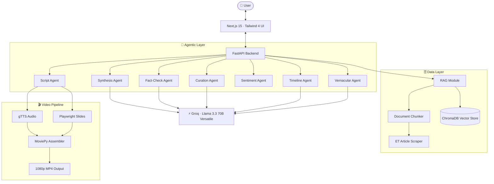

<div align="center">


# ET Pulse ⚡

### The AI-Native Financial Newsroom of the Future

*Built for the Economic Times Hackathon 2026*

<br/>

[](https://economictimes.indiatimes.com/)
[](https://groq.com)
[](https://nextjs.org/)
[](https://fastapi.tiangolo.com/)
[](https://www.trychroma.com/)
[](LICENSE)

<br/>

> **ET Pulse** transforms traditional linear financial journalism into dynamic, personalized, multi-agent intelligence experiences. Stop reading 15 articles to understand one event — get structured briefings, automated video segments, sentiment timelines, and culturally-adapted vernacular summaries, all in seconds.

<br/>

[Explore Features](#-the-5-core-experiences) · [Architecture](#️-system-architecture) · [Quick Start](#️-getting-started) · [Tech Stack](#-tech-stack) · [Contributing](#-contributing)

</div>

---

## 📸 Overview

ET Pulse is a comprehensive financial intelligence platform built on a **multi-agent AI orchestration layer**. It reimagines how users consume complex financial news by delivering:

- **RAG-powered synthesis** across ET's article archives with zero hallucinations
- **Persona-aware feed curation** for students, investors, and professionals
- **Narrative intelligence** that tracks complex financial stories end-to-end
- **AI video generation** that converts briefings into broadcast-ready segments in under 30 seconds
- **Vernacular adaptation** that goes beyond translation into true cultural localization

---

## 🚀 The 5 Core Experiences

### 1. 🔍 News Navigator — RAG Synthesis Engine

Stop reading 15 articles to understand one event. Enter any query and the **Synthesis Agent** retrieves exact, cited snippets from across ET's archives to generate a structured, comprehensive briefing — streamed live.

| Capability | Detail |
|---|---|
| **Embeddings** | Local `all-MiniLM-L6-v2` via `sentence-transformers` |
| **Vector Store** | ChromaDB (persistent, local) |
| **Streaming** | Real-time token delivery via Server-Sent Events (SSE) |
| **Citation** | 100% grounded claims — every statement is source-linked |
| **Glossary** | Inline financial term tooltips for complex jargon |

---

### 2. 📰 My ET Feed — Persona-Driven Curation

No two users are alike. The **Curation Agent** dynamically scores and ranks incoming news stories based on your professional background, portfolio composition, and declared interests.

- **Roles Supported**: Undergraduate Student · Mutual Fund Investor · Tech Founder · Trader · Analyst
- **Justification Blocks**: Every article surfaces a reason — *"This SEBI regulation directly affects your algo-trading portfolio."*
- **Real-Time Rescoring**: Your feed re-ranks itself as new stories break

---

### 3. 📈 Story Arc Tracker — Narrative Intelligence

Financial news doesn't happen in a vacuum. Track complex multi-week sagas — IPO rollouts, hostile takeovers, RBI policy cycles — through a **5-agent parallel intelligence dashboard**.

| Agent | Function |
|---|---|
| **Timeline Agent** | Chronologically plots all major events in a story |
| **Key Players Agent** | Extracts entities, roles, and relationships |
| **Sentiment Agent** | Time-series charting of evolving market mood |
| **Predictions Agent** | Forward-looking AI impact signals |
| **Contrarian Agent** | Surfaces underrepresented and dissenting perspectives |

All five agents run in parallel, updating the dashboard simultaneously.

---

### 4. 🎬 AI Video Studio — Broadcast-Ready in 30 Seconds

Convert any financial brief into a polished, narrated news segment automatically.

```
Groq Script Agent  →  gTTS Audio  →  Playwright Slide Generation  →  MoviePy Assembly  →  1080p MP4
```

- **Output**: Fully assembled 1080p MP4 with synced narration, visual context cards, and ET branding
- **Use Case**: Ready for YouTube Shorts, Instagram Reels, or in-app video briefings
- **Latency**: End-to-end generation in under 30 seconds

---

### 5. 🌐 Vernacular Newsroom — Cultural Adaptation Engine

Financial literacy should have no language barrier. Unlike basic machine translation, the **Vernacular Agent** culturally adapts content — rewriting briefings in the style of *Loksatta* (Marathi) or *Dainik Bhaskar* (Hindi).

**Supported Languages:**

`English` · `Hindi` · `Marathi`

- **Style Adaptation**: Writing tone matched to regional publication standards
- **Regional Glossaries**: Dedicated financial term vocabularies per language
- **Audio Narration**: Full text-to-speech output in the target language

---

## 🏗️ System Architecture

ET Pulse is powered by a multi-agent orchestration layer connecting a Next.js UI to ultra-low-latency Groq inference.



---

## 🧰 Tech Stack

### Backend
| Layer | Technology |
|---|---|
| **Framework** | FastAPI + Uvicorn |
| **LLM Engine** | Groq API — `llama-3.3-70b-versatile` |
| **Orchestration** | LangChain |
| **Vector Database** | ChromaDB (persistent) |
| **Embeddings** | `sentence-transformers` — `all-MiniLM-L6-v2` |
| **Video Generation** | `moviepy` + `playwright` + `gTTS` |
| **Data Validation** | Pydantic v2 |
| **Database** | Supabase (PostgreSQL) |
| **Containerization** | Docker + Docker Compose |

### Frontend
| Layer | Technology |
|---|---|
| **Framework** | Next.js 15 (App Router) |
| **Language** | TypeScript |
| **Styling** | Tailwind CSS 4 |
| **Animations** | Framer Motion |
| **Icons** | Lucide React |
| **Typography** | Inter (Data/UI) + Instrument Serif (Editorial) |

### Design System
- **Theme**: High-contrast dark/light mode with Slate/Zinc base and ET Red + Gold brand accents
- **Effects**: Glassmorphism via `backdrop-filter`, noise textures, micro-interaction animations
- **Philosophy**: Premium Fintech SaaS — professional Lucide SVG iconography, zero emojis

---

## 📂 Project Structure

```
ET-Pulse/
├── backend/
│   ├── app/
│   │   ├── api/            # REST & SSE endpoint definitions
│   │   ├── agents/         # Individual AI agent modules
│   │   │   ├── synthesis.py
│   │   │   ├── curation.py
│   │   │   ├── timeline.py
│   │   │   ├── sentiment.py
│   │   │   ├── vernacular.py
│   │   │   └── script.py
│   │   ├── core/           # App config, settings, dependencies
│   │   ├── models/         # Pydantic schemas & data models
│   │   ├── services/       # RAG pipeline, video assembly, scraper
│   │   │   ├── rag/
│   │   │   │   ├── chunker.py
│   │   │   │   ├── embedder.py
│   │   │   │   └── retriever.py
│   │   │   ├── video/
│   │   │   │   ├── tts.py
│   │   │   │   ├── slides.py
│   │   │   │   └── assembler.py
│   │   │   └── scraper.py
│   │   └── main.py         # FastAPI app entry point
│   ├── requirements.txt
│   ├── .env.example
│   └── docker-compose.yml
│
└── frontend/
    ├── app/
    │   ├── api/            # API client layer
    │   ├── feed/           # My ET Feed page
    │   ├── navigator/      # News Navigator (RAG) page
    │   ├── story/          # Story Arc Tracker page
    │   ├── video/          # AI Video Studio page
    │   ├── vernacular/     # Vernacular Newsroom page
    │   └── page.tsx        # Home / landing page
    ├── components/         # Reusable UI components
    │   ├── ui/
    │   ├── agents/
    │   └── layout/
    ├── lib/                # Utilities, hooks, constants
    ├── public/
    └── .env.example
```

---

## ⚙️ Getting Started

### Prerequisites

- Node.js v18+
- Python 3.10+
- Docker & Docker Compose (optional, for containerized deployment)
- A [Groq API Key](https://console.groq.com/)

---

### 1. Clone the Repository

```bash
git clone https://github.com/your-org/et-pulse.git
cd et-pulse
```

### 2. Configure Environment Variables

**Backend** — create `backend/.env` from the example:
```bash
cp backend/.env.example backend/.env
```

```env
# Required — Groq LLM inference
GROQ_API_KEY=your_groq_api_key_here

# Required — Supabase database
SUPABASE_URL=your_supabase_project_url
SUPABASE_KEY=your_supabase_anon_key

# Optional — Frontend URL for Playwright slide generation
NEXT_PUBLIC_API_URL=http://localhost:3000
```

**Frontend** — create `frontend/.env.local` from the example:
```bash
cp frontend/.env.example frontend/.env.local
```

```env
NEXT_PUBLIC_BACKEND_URL=http://localhost:8000
```

---

### 3a. One-Click Start (Windows — PowerShell)

```powershell
# From the project root — installs all dependencies and starts both servers
.\run_app.ps1
```

This script will:
1. Create a Python virtual environment and install `requirements.txt`
2. Run `npm install` for the frontend
3. Install Playwright's Chromium browser
4. Launch FastAPI on `localhost:8000` and Next.js on `localhost:3000` concurrently

---

### 3b. Manual Start (Linux / macOS)

**Start the Backend:**
```bash
cd backend
python -m venv venv
source venv/bin/activate
pip install -r requirements.txt
playwright install chromium
uvicorn main:app --reload --port 8000
```

**Start the Frontend** (in a separate terminal):
```bash
cd frontend
npm install
npm run dev
```

---

### 3c. Docker Compose

```bash
# From the project root
docker-compose up --build
```

This starts the FastAPI backend, ChromaDB, and Supabase edge proxy in a networked container cluster.

---

### Accessing the Application

| Service | URL |
|---|---|
| **Frontend (Next.js)** | http://localhost:3000 |
| **Backend API (FastAPI)** | http://localhost:8000 |
| **API Docs (Swagger)** | http://localhost:8000/docs |
| **API Docs (ReDoc)** | http://localhost:8000/redoc |

---

## 🌟 Key Design Decisions

### Why Groq?
Ultra-low latency inference is critical for real-time streaming experiences. Groq's LPU architecture delivers token generation speeds that make SSE-streamed briefings feel instant rather than loading.

### Why ChromaDB over Pinecone/Weaviate?
For a hackathon-scale deployment, local ChromaDB provides zero-latency vector retrieval with no external API dependency. The persistent store survives restarts and can be upgraded to a cloud provider trivially.

### Why Multi-Agent over a Single Prompt?
Each agent is independently optimized with a focused system prompt, enabling parallel execution (Story Arc's 5 agents run concurrently), independent failure isolation, and cleaner separation of concerns for future extensibility.

---

## 🤝 Contributing

Contributions are welcome. Please follow these steps:

1. Fork the repository
2. Create a feature branch: `git checkout -b feature/your-feature-name`
3. Commit your changes: `git commit -m 'feat: add your feature'`
4. Push to the branch: `git push origin feature/your-feature-name`
5. Open a Pull Request

Please ensure your PR includes relevant tests and follows the existing code style. For major changes, open an issue first to discuss the proposal.

---

## 📄 License

This project is licensed under the **MIT License**. See [LICENSE](LICENSE) for details.

---

## 🏆 Hackathon Context

ET Pulse was built for the **Economic Times Hackathon 2026**. The vision: move ET from a static news publisher to a **personalized, real-time financial intelligence partner**.

From instant explainer videos for YouTube Shorts to vernacular audio briefings for tier-2 city investors navigating complex IPOs — ET Pulse broadens audience reach while driving deep platform engagement.

---

<div align="center">

Built with ⚡ by the ET Pulse team · Economic Times Hackathon 2026

</div>