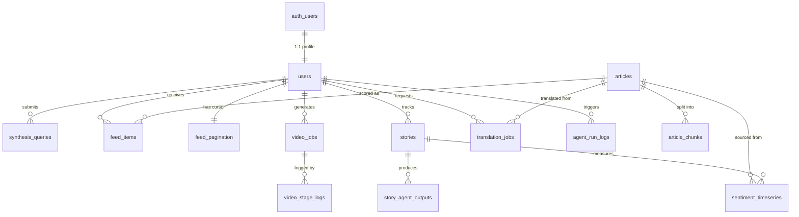

# ET Pulse — Complete Supabase Database Architecture

## Files Delivered

| # | File | Purpose |
|---|------|---------|
| 1 | [001_schema.sql](file:///c:/Users/parsh/OneDrive/Documents/ET%20Pulse/database/001_schema.sql) | 7 enum types, 15 tables, all FKs, indexes, triggers |
| 2 | [002_rls_policies.sql](file:///c:/Users/parsh/OneDrive/Documents/ET%20Pulse/database/002_rls_policies.sql) | RLS enabled on all tables + 25 explicit policies |
| 3 | [003_storage.sql](file:///c:/Users/parsh/OneDrive/Documents/ET%20Pulse/database/003_storage.sql) | 3 storage buckets + owner-scoped access policies |
| 4 | [supabase_client.py](file:///c:/Users/parsh/OneDrive/Documents/ET%20Pulse/backend/db/supabase_client.py) | Python integration — 10 async helper functions |
| 5 | This document | Entity relationship summary + ChromaDB join guide |

---

## Schema Summary



---

## Entity Relationship Summary

### 1:1 Relationships

| Parent | Child | Join Key | Notes |
|--------|-------|----------|-------|
| `auth.users` | `public.users` | `user_id` (UUID) | Every Supabase Auth user gets exactly one profile row |
| `public.users` | `public.feed_pagination` | `user_id` (UUID PK) | One pagination cursor per user |

### 1:Many Relationships

| Parent (1) | Child (Many) | FK Column | Notes |
|------------|-------------|-----------|-------|
| `users` | `synthesis_queries` | `user_id` | Each user can make many RAG queries |
| `users` | `feed_items` | `user_id` | Each user has many curated feed items |
| `users` | `stories` | `user_id` | Each user can track many stories |
| `users` | `video_jobs` | `user_id` | Each user can generate many videos |
| `users` | `translation_jobs` | `user_id` | Each user can request many translations |
| `users` | `agent_run_logs` | `user_id` | Each user triggers many agent runs |
| `articles` | `article_chunks` | `article_id` | One article is split into many chunks |
| `articles` | `feed_items` | `article_id` | One article can appear in many users' feeds |
| `articles` | `sentiment_timeseries` | `source_article_id` | One article can generate many sentiment readings |
| `articles` | `translation_jobs` | `source_article_id` | One article can be translated many times |
| `stories` | `story_agent_outputs` | `story_id` | Each story has outputs from 5 agents (per run) |
| `stories` | `sentiment_timeseries` | `story_id` | Each story accumulates many sentiment data points |
| `video_jobs` | `video_stage_logs` | `job_id` | Each job has up to 4 stage logs |

### Many:Many Bridges

| Table | Bridges Between | Unique Constraint |
|-------|----------------|-------------------|
| `feed_items` | `users` ↔ `articles` | `(user_id, article_id)` — one score per user per article |

---

## ChromaDB ↔ Supabase Join Strategy

> [!IMPORTANT]
> This section is critical for bridging vector search results back to relational data.

ChromaDB stores embeddings with metadata. When ingesting articles into ChromaDB, tag each document with metadata that allows you to join back to Supabase:

### Required ChromaDB Metadata Tags

```python
# When embedding a chunk into ChromaDB, include these metadata fields:
chroma_collection.add(
    ids=[chunk_chroma_id],
    documents=[chunk_text],
    metadatas=[{
        # === Supabase Join Keys ===
        "article_id": str(article_uuid),     # → articles.article_id
        "chunk_id": str(chunk_uuid),         # → article_chunks.chunk_id
        "chunk_index": chunk_index,          # → article_chunks.chunk_index

        # === Existing fields (backward compatible) ===
        "title": article_title,
        "url": article_url,
        "date": published_at_iso,
        "topic": category_string,
        "source": source_name,
        "language": "en",
        "country": "in",
    }],
    embeddings=[embedding_vector],
)
```

### Join Flow: Vector Search → Relational Data

```
User Query
    │
    ▼
ChromaDB.query(query_embedding, n_results=5)
    │
    ▼
Returns: chunk texts + metadata (article_id, chunk_id)
    │
    ▼
Supabase: SELECT * FROM articles WHERE article_id = ANY($1)
    │
    ▼
Full article metadata + user feed state + sentiment data
```

### Joinable Paths from ChromaDB Results

| From ChromaDB `metadata.article_id` you can reach: | Query |
|-----------------------------------------------------|-------|
| Full article metadata | `articles WHERE article_id = ?` |
| All chunks of that article | `article_chunks WHERE article_id = ?` |
| User's feed score for that article | `feed_items WHERE article_id = ? AND user_id = ?` |
| Sentiment readings from that article | `sentiment_timeseries WHERE source_article_id = ?` |
| Translations of that article | `translation_jobs WHERE source_article_id = ?` |

---

## Table Details

### Enum Types (7 total)

| Enum | Values | Used By |
|------|--------|---------|
| `user_role` | student, mf_investor, tech_founder, trader, analyst | `users.role` |
| `story_status` | active, archived | `stories.status` |
| `arc_agent_type` | timeline, key_players, sentiment, predictions, contrarian | `story_agent_outputs.agent_type` |
| `sentiment_label` | positive, neutral, negative | `sentiment_timeseries.sentiment_label` |
| `video_job_status` | queued, processing, complete, failed | `video_jobs.status` |
| `video_stage` | script, tts, slides, assembly | `video_stage_logs.stage` |
| `target_language` | hindi, marathi, english | `translation_jobs`, `language_glossary` |

### Index Strategy

| Pattern | Index Type | Tables |
|---------|-----------|--------|
| `user_id` lookups | B-tree | All user-scoped tables |
| `created_at DESC` | B-tree | All tables with temporal queries |
| `(user_id, relevance_score DESC)` | Composite B-tree | `feed_items` — for sorted feed |
| `(story_id, measured_at DESC)` | Composite B-tree | `sentiment_timeseries` — time-series charts |
| Text search on titles | GIN trigram | `articles`, `language_glossary` |
| URL deduplication | Unique B-tree | `articles.url` |

---

## RLS Policy Summary

| Table | SELECT | INSERT | UPDATE | DELETE | Strategy |
|-------|--------|--------|--------|--------|----------|
| `users` | Own | Own | Own | Own | `auth.uid() = user_id` |
| `articles` | Auth'd | — | — | — | Public read, service write |
| `article_chunks` | Auth'd | — | — | — | Public read, service write |
| `synthesis_queries` | Own | Own | — | — | Immutable audit log |
| `feed_items` | Own | Own | Own | Own | Full user CRUD |
| `feed_pagination` | Own | Own | Own | — | Cursor upsert |
| `stories` | Own | Own | Own | Own | Full user CRUD |
| `story_agent_outputs` | Own* | — | — | — | *Via JOIN to `stories.user_id` |
| `sentiment_timeseries` | Own* | — | — | — | *Via JOIN to `stories.user_id` |
| `video_jobs` | Own | Own | — | — | User creates, service updates |
| `video_stage_logs` | Own* | — | — | — | *Via JOIN to `video_jobs.user_id` |
| `translation_jobs` | Own | Own | — | — | Immutable job records |
| `language_glossary` | Auth'd | — | — | — | Read-only reference data |
| `agent_run_logs` | Own | — | — | — | Read own, service writes |
| `api_usage_logs` | — | — | — | — | Service-only (no policies) |

---

## Storage Buckets

| Bucket | Public | Size Limit | MIME Types | Access Pattern |
|--------|--------|-----------|------------|----------------|
| `video-outputs` | No | 100 MB | MP4, WebM | `{user_id}/*.mp4` |
| `audio-outputs` | No | 20 MB | MP3, WAV, OGG | `{user_id}/*.mp3` |
| `article-media` | Yes | 10 MB | JPEG, PNG, WebP, GIF, SVG | Public read, service write |

> [!TIP]
> Upload files with the path pattern `{user_id}/{filename}` to leverage the folder-based RLS policies automatically.

---

## Python Integration Quick Reference

```python
from backend.db import (
    insert_feed_item,          # (a) Score an article for a user
    get_story_agent_outputs,   # (b) Get all 5 agents' outputs for a story
    log_agent_run,             # (c) Observability logging
    upsert_article,            # Ingest an article from newsdata.io
    save_story_agent_output,   # Persist one agent's output
    bulk_insert_feed_items,    # Batch score articles
    create_video_job,          # Start a video pipeline
    update_video_job_status,   # Update pipeline status
    log_api_usage,             # Track newsdata.io calls
)
```

### Example: Score and insert a feed item

```python
# Inside your curation agent route handler:
await insert_feed_item(
    user_id="d4e5f6a7-...",
    article_id="a1b2c3d4-...",
    relevance_score=0.87,
    justification="This SEBI regulation directly affects your algo-trading portfolio.",
)
```

### Example: Get story arc outputs

```python
# Returns dict keyed by agent_type:
outputs = await get_story_agent_outputs(story_id="abc123...")
timeline = outputs.get("timeline", {}).get("output_json", {})
sentiment = outputs.get("sentiment", {}).get("output_json", {})
```

### Example: Log an agent run

```python
await log_agent_run(
    agent_type="synthesis",
    module="news_navigator",
    prompt_tokens=1200,
    completion_tokens=850,
    latency_ms=1340,
    user_id="d4e5f6a7-...",
)
```

---

## Migration Order

Run these in your Supabase SQL Editor in sequence:

1. `database/001_schema.sql` — Enums, tables, indexes, triggers
2. `database/002_rls_policies.sql` — Enable RLS + create all policies
3. `database/003_storage.sql` — Create buckets + storage access policies

> [!CAUTION]
> The schema references `auth.users` — ensure Supabase Auth is enabled on your project _before_ running the migration. The `users` table has a foreign key to `auth.users(id)`.
